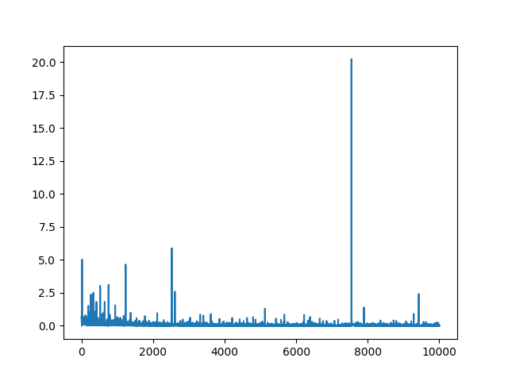
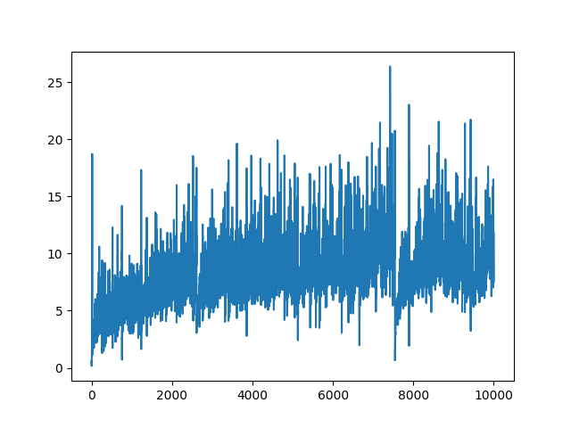
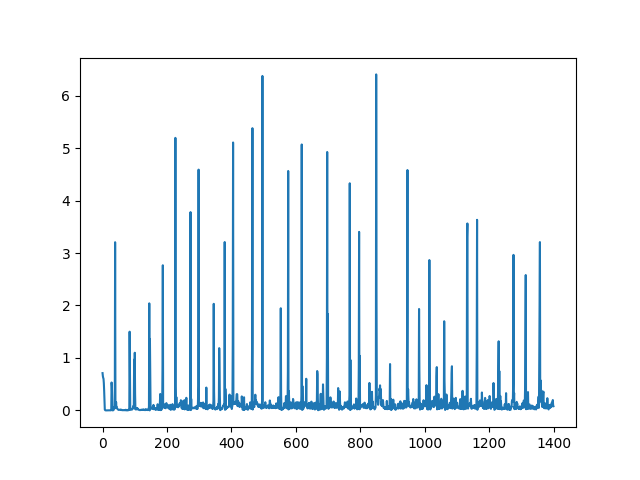
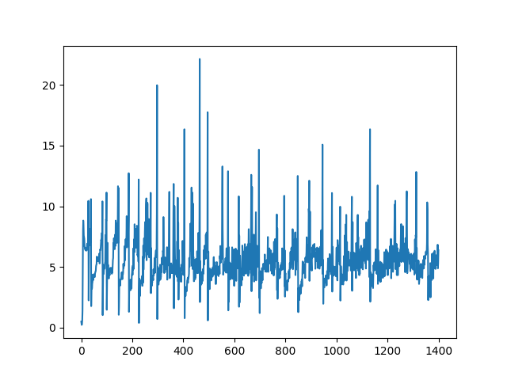

# Lapses
Lapses is a repository that aims to depict the progression of dementia using mathematics and machine learning. The repository contains an implementation of a deep convolutional generative adversarial network (DCGAN) that generates images depicting the progression of dementia, with the intention of destroying them during the generation process to represent the loss of cognitive function, i.e. with the end-goal of dementia.

## How it works
The deep convolutional generative adversarial network (DCGAN) uses convolutional neural networks to generate images. In the context of Lapses, the DCGAN is used to generate a series of images that depict the progression of dementia, with each image representing a stage in the disease's progression.

The real images used in the training set were obtained by scraping 10,000 images from [thispersondoesnotexist.com](thispersondoesnotexist.com). These images are computer-generated faces that do not represent any real individuals.

## Using it
The implementation of the DCGAN is currently a Jupyter notebook in Python and is still a work in progress. Once completed, users will be able to use the notebook to train the DCGAN on the provided dataset and generate images that depict the progression of dementia.


## Generator
The generator implements a multi-deep layer architecture for generating $128 \times 128 \times 3$ images. Two versions are implemented to generate fake images given dataset $X$ (thispersondoesnotexists.com) from a latent $z$ vector. DCGAN(1) is trained on $\frac{1}{10}$ of dataset $X$. This tries to generate a variety of images. DCGAN(2) is trained on $[x_i, x_k] \in X$, i.e on a small subset (say 5-10 images) from $X$. This is to achieve higher quality images at the expense of variety. However, we are not concerned with variety of images. We are focused on creating a network that can generate images given some $n$ sized dataset, our "memory" in this case, of a few people (images). Our purpose is to break it apart to depict cognitive loss in patients with dementia. 

### Samples
#### DCGAN (1)
| Epochs            | Batch Size        | Sample Interval   | Dataset Size ($X$)| Latent Size ($z$)
|-------------------|-------------------|-------------------|---------------------|------|
| 10,000            | 32                | 20                | 1,000       |128|

https://user-images.githubusercontent.com/70508631/222946076-31350c71-226b-4906-a869-72ec38d0a975.mp4

##### Discriminator Loss:

##### Generator Loss:


##### Using the model
Import the required libraries

```python
import numpy as np
import tensorflow as tf
from tensorflow import keras
```

Load in the model from `dcgan-1/generator`
```python
model = keras.models.load_model('dcgan-1/generator')
```

Test the model
```python
noise = tf.random.normal([1, 128])
result = model.predict(noise)
```
Plot (view) the generated image
```python
result = (result+1) / 2
plt.imshow(result[0, :, :, :])
```

#### DCGAN (2)
| Epochs | Batch Size|Sample Interval|Dataset Size ($X$)|Latent Size ($z$) |
|-------------------|-------------------|-------------------|-------------------|--|
| 1400  | 32  | 20  | 37 (same image)  | 128|

https://user-images.githubusercontent.com/70508631/222946158-6c4ab0a5-3931-4762-bfb8-3884354b1750.mp4

##### Discriminator Loss:


##### Generator Loss:


##### Using the model

Import the required libraries
```python
import numpy as np
import tensorflow as tf
from tensorflow import keras
```

Load in the model from `dcgan-2/generator`
```python
model = keras.models.load_model('dcgan-2/generator')
```

Test the model
```python
noise = tf.random.normal([1, 128])
result = model.predict(noise)
```
Plot (view) the generated image
```python
result = (result+1) / 2
plt.imshow(result[0, :, :, :])
```

##### Data
Data can be found on [Kaggle](https://www.kaggle.com/datasets/pablobedolla/this-person-does-not-exist-data)
